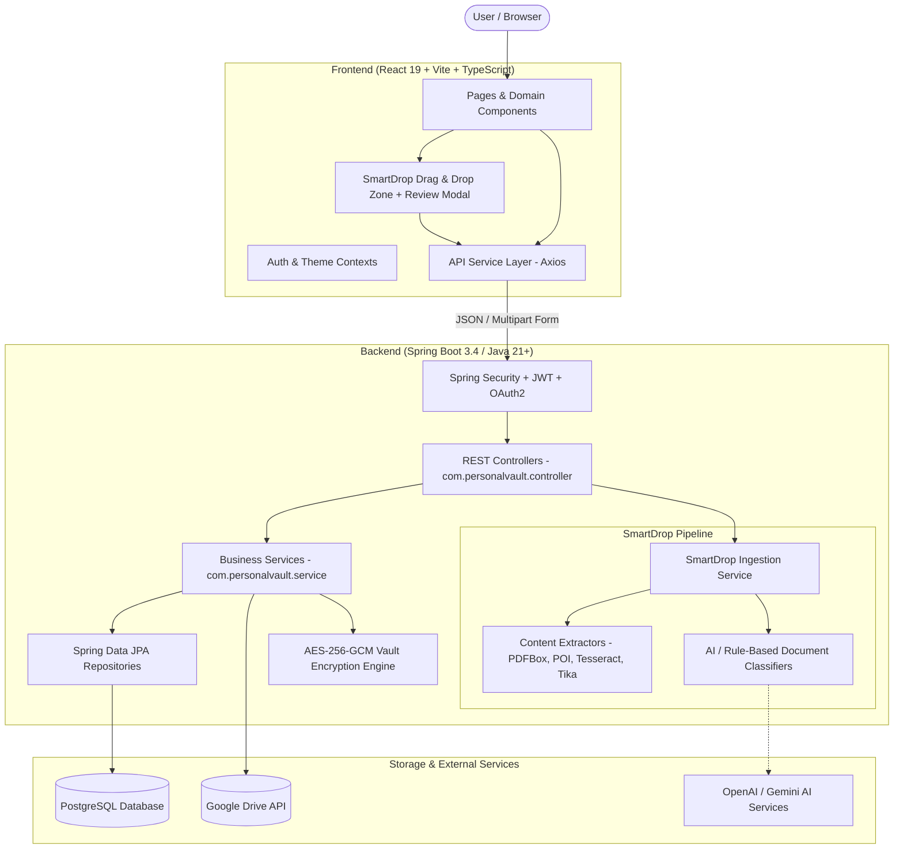
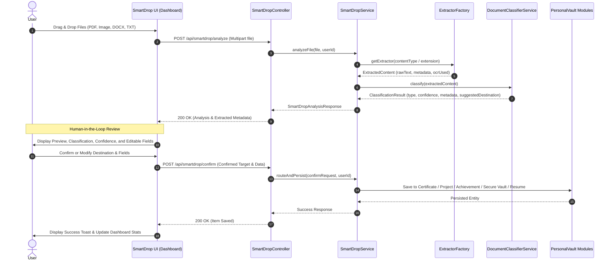

# PersonalVault Architecture

## 1. System Overview

PersonalVault is a modular, secure career portfolio and digital vault application built as a clean monorepo:

- `frontend/`: React 19 + TypeScript + Vite + Tailwind CSS client
- `backend/`: Spring Boot 3.4 (Java 21+) REST API application

The frontend and backend operate independently and communicate strictly through structured, typed HTTP/JSON REST APIs with JWT-based authentication and AES-256-GCM encrypted vault storage.

---

## 2. High-Level System Architecture



---

## 3. Frontend Architecture

The frontend follows a **clean, layered architecture** where all top-level domain concerns are grouped by their layer rather than deeply nested feature packages.

```text
frontend/src/
├── assets/             # Static assets, logos, and illustrations
├── components/         # Reusable and domain-specific UI components
│   ├── common/         # Generic UI (Button, Modal, Card, Navbar, etc.)
│   ├── auth/           # Login, Register, ProtectedRoute
│   ├── dashboard/      # Dashboard widgets, stats, quick-action cards
│   ├── smartdrop/      # SmartDropZone, SmartDropModal, FileItemPreview
│   ├── projects/       # ProjectCard, ProjectModal, ProjectForm
│   ├── certificates/   # CertificateCard, CertificateModal
│   ├── skills/         # SkillBadge, SkillCategoryList, SkillModal
│   ├── achievements/   # AchievementCard, AchievementModal
│   ├── vault/          # VaultFileCard, VaultSecurityModal, EncryptedViewer
│   ├── resume/         # ResumeBuilder, SectionEditor, TemplateSelector
│   ├── social/         # SocialLinksList, SocialLinkModal
│   ├── expenses/       # ExpenseList, ExpenseSummaryCard, ExpenseModal
│   └── profile/        # ProfileHeader, UserSettingsForm
├── contexts/           # Global React Contexts (AuthContext, ThemeContext)
├── hooks/              # Custom reusable React hooks (useAuth, useDebounce, etc.)
├── layouts/            # Page layout wrappers (MainLayout, AuthLayout, DashboardLayout)
├── pages/              # All application route view pages
│   ├── HomePage.tsx
│   ├── LoginPage.tsx
│   ├── RegisterPage.tsx
│   ├── DashboardPage.tsx
│   ├── ProjectsPage.tsx
│   ├── CertificatesPage.tsx
│   ├── SkillsPage.tsx
│   ├── AchievementsPage.tsx
│   ├── VaultPage.tsx
│   ├── ResumeBuilderPage.tsx
│   ├── SocialLinksPage.tsx
│   ├── ExpensesPage.tsx
│   └── ProfilePage.tsx
├── routes/             # App routing tree and authentication guards (AppRoutes.tsx)
├── services/           # Typed Axios API clients (authService, projectService, smartdropService, etc.)
├── styles/             # Tailwind CSS tokens, animations, and global stylesheets
├── types/              # Domain TypeScript interfaces and API DTO models
└── utils/              # Pure utility functions (formatting, date, validation)
```

### Layer Responsibilities

- **`pages/`**: Route entry-point components. Responsible for page-level state orchestration, data fetching triggers, and coordinating domain components.
- **`components/`**: Modular, presentational, and interactive components grouped cleanly by domain folder.
- **`services/`**: Centralized HTTP API calls using a configured Axios client instance (`api.ts`). Zero raw fetch/Axios in components.
- **`types/`**: Strongly-typed interfaces matching backend DTO schemas for compile-time safety.
- **`contexts/`**: Shared client-side global state (User authentication state, JWT tokens, active themes).

---

## 4. Backend Architecture

The backend follows a **flat layered Spring Boot architecture** with unified packages under `com.personalvault`:

```text
backend/src/main/java/com/personalvault/
├── config/             # Spring configuration (CorsConfig, SecurityConfig, AppConfig)
├── security/           # JWT filters, TokenProvider, UserDetailsService, PasswordEncoder
├── controller/         # REST API Controllers (AuthController, ProjectController, SmartDropController, etc.)
├── dto/                # Request and Response Data Transfer Objects
├── entity/             # JPA Domain Entities (User, Project, Certificate, VaultItem, etc.)
├── repository/         # Spring Data JPA Repository interfaces
├── service/            # Business logic and transaction orchestration services
├── extractor/          # SmartDrop content extractors (PDF, DOCX, Image, Text)
├── classifier/         # SmartDrop classification strategies (OpenAI, Gemini, RuleBased)
├── model/              # Internal domain models (ExtractedContent, ClassificationResult)
├── mapper/             # Entity <-> DTO conversion mappers
├── exception/          # GlobalExceptionHandler and domain-specific exceptions
└── util/               # Security, encryption, and cryptographic helpers (AESGCMUtil, FileUtils)
```

### Backend Layer Responsibilities

- **`controller/`**: Handles HTTP requests, enforces request validation (`@Valid`), and returns `ResponseEntity<ApiResponse<T>>` or DTOs.
- **`service/`**: Implements core business logic, permissions enforcement, database transactions (`@Transactional`), and external service coordination.
- **`extractor/` & `classifier/`**: Implements the content extraction and document classification engines for SmartDrop.
- **`entity/` & `repository/`**: Defines relational schema and Spring Data queries.
- **`dto/`**: Encapsulates API payload contracts, decoupling REST contracts from JPA entities.
- **`security/` & `util/`**: Enforces stateless JWT validation, user session identity, and AES-256-GCM vault encryption.

---

## 5. SmartDrop Intelligent Ingestion Pipeline

SmartDrop allows users to drop single or multiple documents of various formats (PDF, DOCX, TXT, Images) onto PersonalVault. It extracts content, classifies the document using AI or heuristic models, extracts structured metadata, and presents a **Human-in-the-Loop confirmation dialog** before persisting to the user's vault or portfolio.



### Content Extraction Engines (`com.personalvault.extractor`)
- **`PdfContentExtractor`**: Uses **Apache PDFBox** for text rendering. Falls back to **Tesseract OCR** for scanned/image-only PDFs.
- **`DocxContentExtractor`**: Uses **Apache POI** (`XWPFDocument`) to extract paragraphs, tables, and document properties.
- **`TextContentExtractor`**: Direct stream parsing with encoding detection.
- **`ImageContentExtractor`**: Performs optical character recognition via **Tesseract OCR / Vision**.

### Classification Engines (`com.personalvault.classifier`)
- **`OpenAiDocumentClassifier` / `GeminiDocumentClassifier`**: LLM-driven structured JSON classification identifying document type, confidence score, and domain metadata (e.g. `issuingOrganization`, `credentialId`, `technologies`, `dates`).
- **`RuleBasedDocumentClassifier`**: Resilient fallback regex and heuristic rule engine ensuring zero-breakage when offline or when no API key is provided.

### Destination Mapping
1. **`CERTIFICATE`** $\rightarrow$ `Certificates` module
2. **`PROJECT`** $\rightarrow$ `Projects` module
3. **`ACHIEVEMENT`** $\rightarrow$ `Achievements` module
4. **`IDENTITY_DOCUMENT`** $\rightarrow$ `Secure Vault` (Identity Documents)
5. **`FINANCIAL_DOCUMENT`** $\rightarrow$ `Secure Vault` (Financial Documents)
6. **`EDUCATIONAL_DOCUMENT`** $\rightarrow$ `Secure Vault` (Educational Documents)
7. **`RESUME`** $\rightarrow$ `Resume Builder` import workflow
8. **`OTHER_DOCUMENT`** $\rightarrow$ `Secure Vault` (Other Documents)

---

## 6. Secure Vault & Privacy Architecture

The Secure Vault module stores sensitive records (Government IDs, Tax documents, Academic transcripts, Bank statements):

- **Encryption at Rest**: Files and sensitive fields are encrypted using **AES-256-GCM** with unique initialization vectors (IV) before storage.
- **Zero Logging Policy**: Content extractors and classifiers sanitize sensitive PII and never write raw identity or financial details to application logs.
- **Access Control**: Every vault query is scoped to `SecurityUtils.getCurrentUserId()` preventing IDOR or cross-tenant data leakage.

---

## 7. API Communication & Contract Rules

1. **Layered Isolation**: Controllers never expose JPA Entities directly; all responses return `ApiResponse<T>` or strongly-typed DTOs.
2. **Frontend Service Encapsulation**: React components never invoke `axios` directly; all API calls are made via typed functions in `src/services/`.
3. **Stateless Authentication**: Frontend attaches JWT tokens in the `Authorization: Bearer <token>` header, verified by backend Spring Security filters.
