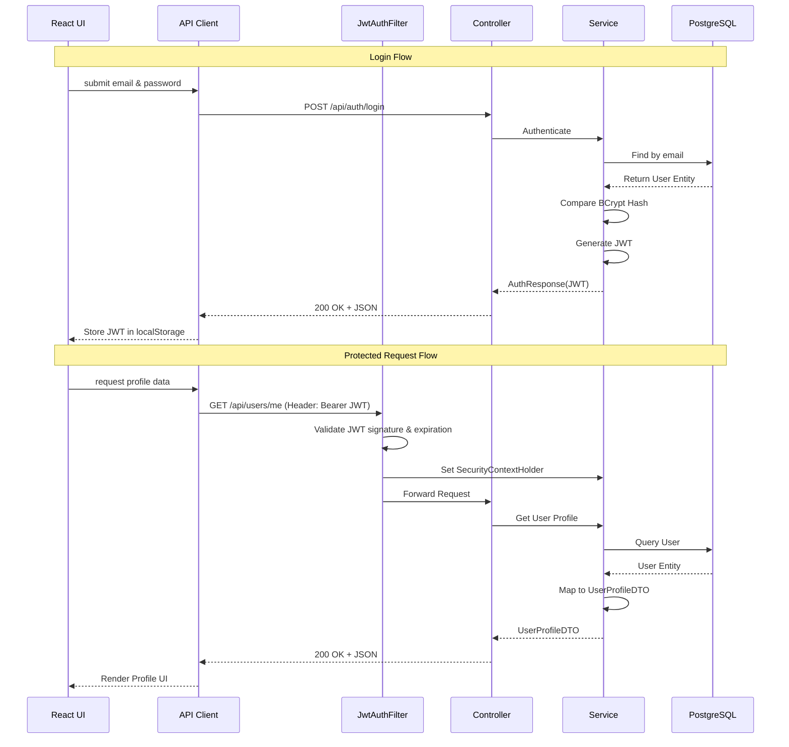

# PersonalVault Authentication & Profile Roadmap

This document provides a COMPLETE, exact implementation blueprint for manually building the Authentication and User Profile features.

## Request Flows

### REGISTRATION
`Browser` → `React form` → `Frontend validation (Zod)` → `Axios` → `POST /api/auth/register` → `AuthController` → `DTO validation (@Valid)` → `AuthService` → `Password hashing (BCrypt)` → `User Entity creation` → `UserRepository` → `PostgreSQL` → `AuthResponseDTO (with JWT)` → `React (stores token)`

### LOGIN
`Browser` → `React form` → `Axios` → `POST /api/auth/login` → `AuthController` → `AuthenticationManager` → `CustomUserDetailsService` → `UserRepository lookup` → `BCrypt password verification` → `JwtService generates token` → `AuthResponseDTO` → `React (stores token)`

### PROTECTED REQUEST
`React` → `Axios interceptor adds Authorization: Bearer JWT` → `Spring Security JwtAuthenticationFilter` → `JwtService validates signature/expiration` → `SecurityContext holder gets authenticated user` → `Controller` → `Service` → `Repository` → `PostgreSQL` → `Response`

### PROFILE
`React` → `GET /api/users/me` (with JWT) → `JwtAuthenticationFilter` validates token → `UserController` injects `Authentication` object → `UserService.getUserProfile(email)` → `UserRepository` → `User Entity` → `UserProfileDTO` → `React`

---

## Architecture Rules & Decisions

- **Security Logic**: Goes in `backend/src/main/java/com/personalvault/security/`. Contains filters, security config, JWT utilities, and `UserDetailsService`.
- **Business Logic**: Goes in `backend/src/main/java/com/personalvault/service/`. This is where all decision-making happens (e.g., checking if an email exists before saving).
- **Database Access**: Goes in `backend/src/main/java/com/personalvault/repository/`. Only Spring Data JPA interfaces. No business logic here.
- **HTTP Requests**: Goes in `backend/src/main/java/com/personalvault/controller/`. Responsible ONLY for receiving requests, passing them to the service, and returning HTTP responses. No DB queries, no hashing, no JWT generation.
- **Request/Response Shapes**: Goes in `backend/src/main/java/com/personalvault/dto/`. DTOs (Data Transfer Objects) ensure we never expose database entities directly to the outside world.
- **JWT Secret**: Configured in `application.properties` as `jwt.secret=${JWT_SECRET}`. The actual secret is provided via an environment variable.
- **Secrets in Git**: NEVER commit passwords, DB credentials, or JWT secrets. Use `.env` files for local development.
- **Environment Variables**: Use `.env` in the root of backend/frontend. Gitignore `.env` and `.env.*` files. Commit `.env.example` with dummy values so teammates know what variables are required.
- **JWT Storage (localStorage vs Cookies)**: For this college project, `localStorage` is completely fine. It is easy to implement. *Tradeoff*: Vulnerable to XSS (Cross-Site Scripting) if your React app renders unsanitized user input. HttpOnly cookies are more secure against XSS but harder to configure for cross-origin requests and vulnerable to CSRF.
- **Refresh Tokens**: Skip them for now to keep the first implementation simple. Set the JWT expiration to a reasonable time (e.g., 24 hours).
- **Logout with Stateless JWT**: The backend doesn't store session state. Logout simply means the frontend deletes the JWT from `localStorage` and clears the React context state. The token remains cryptographically valid until it expires, but the client throws it away.
- **Expired/Invalid JWT**: The `JwtAuthenticationFilter` will fail to parse it, and Spring Security will return an HTTP 401 Unauthorized.
- **Validation Errors**: Triggered by `@Valid` on controllers. A `@ControllerAdvice` (`GlobalExceptionHandler`) intercepts `MethodArgumentNotValidException` and returns a structured HTTP 400 Bad Request.
- **Duplicate Email**: `AuthService` checks `userRepository.existsByEmail()`. If true, it throws a custom `DuplicateResourceException`. The global handler catches it and returns HTTP 409 Conflict.
- **Incorrect Credentials**: Handled by Spring Security. If bad, return a generic HTTP 401 "Invalid email or password". Never specify *which* one was wrong, to prevent email enumeration attacks.
- **Obtaining Authenticated User Safely**: In the controller, use `@AuthenticationPrincipal UserDetails userDetails` as a method parameter. This pulls the safely verified user from the Spring Security context, ensuring a user can only request their own data.
- **Mappers**: A mapper is genuinely useful to cleanly copy data between Entities and DTOs without cluttering services. Since we only have one entity right now, a simple manual static mapper (`UserMapper.java`) is perfect. No need for heavy libraries like MapStruct yet.

---

## Step-by-Step Implementation Guide

### STEP 1: Registration DTO
- **Path**: `backend/src/main/java/com/personalvault/dto/auth/RegisterRequest.java` (New)
- **What it does**: Represents the JSON payload for registration.
- **Contents**: `name`, `email`, `password` fields with getters/setters.
- **Connection**: Used as `@RequestBody` in AuthController.

### STEP 2: Login DTO
- **Path**: `backend/src/main/java/com/personalvault/dto/auth/LoginRequest.java` (New)
- **What it does**: Represents the JSON payload for login.
- **Contents**: `email`, `password` fields.

### STEP 3: Authentication Response DTO
- **Path**: `backend/src/main/java/com/personalvault/dto/auth/AuthResponse.java` (New)
- **What it does**: The payload returned on successful login/register.
- **Contents**: `token` (String) and maybe a `UserProfileDTO` object.

### STEP 4: User Profile DTO
- **Path**: `backend/src/main/java/com/personalvault/dto/auth/UserProfileDTO.java` (New)
- **What it does**: Safe representation of a user without sensitive data.
- **Contents**: `id`, `name`, `email`, `createdAt`. (Notice: no `passwordHash`).

### STEP 5: Validation Rules
- **Path**: Modify DTOs from steps 1-4.
- **What it does**: Ensures bad data doesn't reach services.
- **Contents**: Add `@NotBlank`, `@Email`, and `@Size(min=8)` annotations to DTO fields.
- **Not implemented yet**: Global exception handler to format these errors (done in step 18).

### STEP 6: Mapper Layer
- **Path**: `backend/src/main/java/com/personalvault/mapper/auth/UserMapper.java` (New)
- **What it does**: Converts `User` entity to `UserProfileDTO`.
- **Contents**: Static method `toProfileDTO(User user)`.

### STEP 7: Password Encoder
- **Path**: `backend/src/main/java/com/personalvault/config/AppConfig.java` (New)
- **What it does**: Creates a Spring Bean for BCrypt.
- **Contents**: `@Bean public PasswordEncoder passwordEncoder() { return new BCryptPasswordEncoder(); }`.

### STEP 8: JWT Dependency & Configuration
- **Path**: `backend/pom.xml` & `application.properties` (Modify)
- **What it does**: Adds JJWT libraries and secret properties.
- **Contents**: Add `jjwt-api`, `jjwt-impl`, `jjwt-jackson`. Add `jwt.secret` and `jwt.expiration` in properties.

### STEP 9: JWT Service
- **Path**: `backend/src/main/java/com/personalvault/security/JwtService.java` (New)
- **What it does**: Handles all JWT cryptography.
- **Contents**: `generateToken(UserDetails)`, `extractUsername(token)`, `isTokenValid(token)`.

### STEP 10: UserDetailsService
- **Path**: `backend/src/main/java/com/personalvault/security/CustomUserDetailsService.java` (New)
- **What it does**: Tells Spring Security how to find a user in the DB.
- **Contents**: Implements `UserDetailsService`. Injects `UserRepository`. Loads user by email. Throws `UsernameNotFoundException` if not found.

### STEP 11: JWT Authentication Filter
- **Path**: `backend/src/main/java/com/personalvault/security/JwtAuthenticationFilter.java` (New)
- **What it does**: Intercepts HTTP requests, checks for JWT, validates it, and sets security context.
- **Contents**: Extends `OncePerRequestFilter`. Reads `Authorization` header. Calls `JwtService`.

### STEP 12: Spring Security Configuration
- **Path**: `backend/src/main/java/com/personalvault/security/SecurityConfig.java` (New)
- **What it does**: Wires all security components together.
- **Contents**: Configures `SecurityFilterChain`. Sets session management to stateless. Disables CSRF. Permits `/api/auth/**`. Requires auth for `anyRequest()`. Configures `AuthenticationManager` bean. Adds `JwtAuthenticationFilter` before `UsernamePasswordAuthenticationFilter`.

### STEP 13 & 14: Registration & Login Logic
- **Path**: `backend/src/main/java/com/personalvault/service/auth/AuthService.java` (New)
- **What it does**: Business logic for auth.
- **Contents**:
  - `register`: Checks if email exists, hashes password, saves User, generates JWT.
  - `login`: Uses `AuthenticationManager` to authenticate, generates JWT.

### STEP 15: Auth Controller
- **Path**: `backend/src/main/java/com/personalvault/controller/auth/AuthController.java` (New)
- **What it does**: REST endpoints for auth.
- **Contents**: `@PostMapping("/register")` and `@PostMapping("/login")`. Takes `@Valid` requests, calls `AuthService`, returns `ResponseEntity<AuthResponse>`.

### STEP 16 & 17: User/Profile Service & Controller
- **Path**: `backend/src/main/java/com/personalvault/service/auth/UserService.java` & `controller/auth/UserController.java` (New)
- **What it does**: Fetches and updates user profile data.
- **Contents**: Controller `@GetMapping("/me")`. Injects `Principal`. Service uses `UserRepository` to fetch user, uses `UserMapper` to return `UserProfileDTO`.

### STEP 18: Global Exception Handling
- **Path**: `backend/src/main/java/com/personalvault/exception/GlobalExceptionHandler.java` (New)
- **What it does**: Catches backend exceptions and converts them to clean JSON responses.
- **Contents**: `@ControllerAdvice`. Handles `MethodArgumentNotValidException` (400), `BadCredentialsException` (401), custom `DuplicateResourceException` (409).

### STEP 19 & 20: Backend Testing
- **Action**: Run Spring Boot app.
- **Action**: Use Postman/cURL to test `/api/auth/register`, `/api/auth/login`, and `/api/users/me` (with and without token).

### STEP 21: Frontend API Client
- **Path**: `frontend/src/services/apiClient.ts` (New)
- **What it does**: Centralized Axios instance.
- **Contents**: Configured with backend base URL. Adds a request interceptor to attach `localStorage.getItem('token')` to the `Authorization` header.

### STEP 22: Frontend Auth Types
- **Path**: `frontend/src/features/auth/types/index.ts` (New)
- **What it does**: TypeScript definitions mirroring backend DTOs.
- **Contents**: `User`, `LoginCredentials`, `RegisterCredentials`, `AuthResponse`.

### STEP 23: Auth Service (Frontend)
- **Path**: `frontend/src/features/auth/services/authService.ts` (New)
- **What it does**: Axios API calls for auth endpoints.
- **Contents**: `login()`, `register()`, `getProfile()`.

### STEP 24: Auth Context
- **Path**: `frontend/src/contexts/AuthContext.tsx` (New)
- **What it does**: Global state management for authentication.
- **Contents**: State for `user` and `isAuthenticated`. Functions for `login`, `register`, `logout`. (Logout removes token from localStorage and sets user to null).

### STEP 25 & 26: Login & Registration Pages
- **Path**: `frontend/src/features/auth/pages/LoginPage.tsx` & `RegisterPage.tsx` (New)
- **What it does**: UI forms for authentication.
- **Contents**: HTML forms hooked up with React Hook Form.

### STEP 27: Protected Route
- **Path**: `frontend/src/routes/ProtectedRoute.tsx` (New)
- **What it does**: Prevents unauthenticated users from seeing certain pages.
- **Contents**: Reads `AuthContext`. If `!isAuthenticated`, returns `<Navigate to="/login" />`. Otherwise returns `<Outlet />`.

### STEP 28: Application Routing
- **Path**: `frontend/src/routes/AppRoutes.tsx` & `App.tsx` (Modify)
- **What it does**: Sets up React Router URLs.
- **Contents**: Maps `/login` to `LoginPage`, `/register` to `RegisterPage`, and wraps `/profile` inside `ProtectedRoute`.

### STEP 29: Authentication Persistence
- **Path**: `frontend/src/contexts/AuthContext.tsx` (Modify)
- **What it does**: Keeps user logged in on page refresh.
- **Contents**: `useEffect` that runs on mount. Checks localStorage for token. If found, calls `authService.getProfile()` to validate token and populate user state.

### STEP 30: Logout
- **Path**: Anywhere in UI (e.g., Navbar component).
- **What it does**: Clears session.
- **Contents**: Calls `logout()` from `AuthContext`.

### STEP 31 & 32: Profile Page & Update
- **Path**: `frontend/src/features/auth/pages/ProfilePage.tsx` (New)
- **What it does**: Displays `UserProfileDTO` and allows updates (if PUT endpoint implemented).

### STEP 33: Frontend Validation
- **Path**: Modifies UI components.
- **What it does**: Real-time form validation.
- **Contents**: Use Zod schemas integrated with React Hook Form's resolver.

### STEP 34 & 35: Error Handling & Integration Test
- **Action**: Ensure Axios interceptor handles 401 errors by logging the user out automatically.
- **Action**: Test the entire flow from browser to database and back.

---

## A. COMPLETE FILE TREE (Post-Implementation)

**Backend:**
```text
backend/src/main/java/com/personalvault/
├── config/
│   └── AppConfig.java
├── controller/
│   └── auth/
│       ├── AuthController.java
│       └── UserController.java
├── dto/
│   └── auth/
│       ├── AuthResponse.java
│       ├── LoginRequest.java
│       ├── RegisterRequest.java
│       └── UserProfileDTO.java
├── entity/
│   └── auth/
│       └── User.java (ALREADY DONE)
├── exception/
│   ├── DuplicateResourceException.java
│   └── GlobalExceptionHandler.java
├── mapper/
│   └── auth/
│       └── UserMapper.java
├── repository/
│   └── auth/
│       └── UserRepository.java (ALREADY DONE)
├── security/
│   ├── CustomUserDetailsService.java
│   ├── JwtAuthenticationFilter.java
│   ├── JwtService.java
│   └── SecurityConfig.java
└── service/
    └── auth/
        ├── AuthService.java
        └── UserService.java
```

**Frontend:**
```text
frontend/src/
├── App.tsx
├── contexts/
│   └── AuthContext.tsx
├── features/
│   └── auth/
│       ├── pages/
│       │   ├── LoginPage.tsx
│       │   ├── ProfilePage.tsx
│       │   └── RegisterPage.tsx
│       ├── services/
│       │   └── authService.ts
│       └── types/
│           └── index.ts
├── routes/
│   ├── AppRoutes.tsx
│   └── ProtectedRoute.tsx
└── services/
    └── apiClient.ts
```

---

## D. COMPLETE API ENDPOINT TABLE

| Method | Endpoint | Auth Required? | Request Body | Response Body | Purpose |
| :--- | :--- | :--- | :--- | :--- | :--- |
| POST | `/api/auth/register` | No | `RegisterRequest` | `AuthResponse` | Create new user & return JWT |
| POST | `/api/auth/login` | No | `LoginRequest` | `AuthResponse` | Verify credentials & return JWT |
| GET | `/api/users/me` | Yes (JWT) | None | `UserProfileDTO` | Get current logged-in user profile |
| PUT | `/api/users/me` | Yes (JWT) | `UserProfileDTO` | `UserProfileDTO` | Update profile information |

---

## E. Database Table Structure (PostgreSQL)

Table: `users`
- `id` (BIGSERIAL, PRIMARY KEY)
- `name` (VARCHAR, NOT NULL)
- `email` (VARCHAR, UNIQUE, NOT NULL)
- `password_hash` (VARCHAR, NOT NULL)
- `created_at` (TIMESTAMP)
- `updated_at` (TIMESTAMP)

*(Note: Spring Data JPA with `ddl-auto=update` will generate this automatically from your `User.java` entity).*

---

## F. Authentication Flow Diagram



---

## G. Testing Checklist

- [ ] Register with valid data -> 200 OK, JWT returned.
- [ ] Register with existing email -> 409 Conflict.
- [ ] Register with invalid email format -> 400 Bad Request.
- [ ] Login with valid credentials -> 200 OK, JWT returned.
- [ ] Login with wrong password -> 401 Unauthorized.
- [ ] Login with non-existent email -> 401 Unauthorized.
- [ ] Access `/api/users/me` without token -> 401 Unauthorized.
- [ ] Access `/api/users/me` with valid token -> 200 OK, Profile JSON.
- [ ] Frontend: Login redirects to dashboard/profile.
- [ ] Frontend: Refreshing browser keeps user logged in.
- [ ] Frontend: Clicking Logout clears token and redirects to login.

---

## H. Git Commit Plan

To keep your history clean, commit in these logical phases:

1. `feat: add auth DTOs and validation rules` (Steps 1-6)
2. `feat: setup JWT utility and spring security config` (Steps 7-12)
3. `feat: implement auth service and controllers` (Steps 13-17)
4. `feat: add global exception handling` (Step 18)
5. `feat(ui): setup axios client and auth types` (Steps 21-23)
6. `feat(ui): create auth context and route guards` (Steps 24, 27-30)
7. `feat(ui): build login, register, and profile pages` (Steps 25, 26, 31-35)
